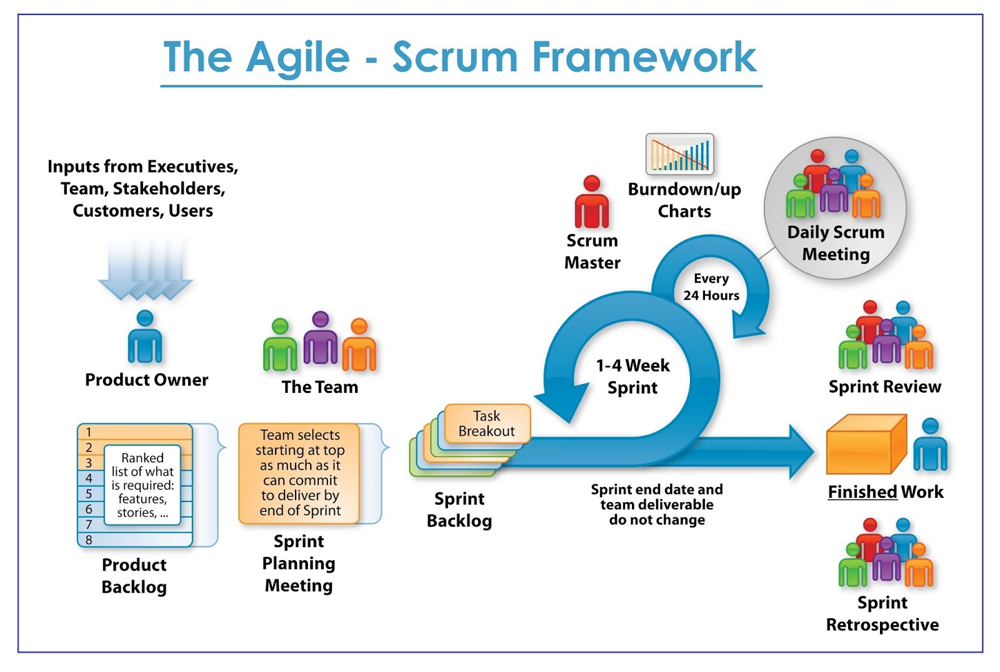

# Agile & Scrum

## Methodologies

- Agile
- Scrum
- Scrum Ceremonies
- Epic and User Stories
- Kanban

### Agile:

_The 4 Main Agile Values in the **Agile Manifesto:**_

- Individuals and interactions over processes and tools.
- Working software over comprehensive documentation.
- Customer collaboration over contract negotiation.
- Responding to change over following a plan.

[Agile Manifesto](https://agilemanifesto.org/)

### Scrum

- The Process: 
	- The Product Owner builds the product backlog and the development team prioritise it.
	- The team then looks at this backlog and they pull work from it. Then team decides how much stuff they can take into the scrum and what they can deliver in a cycle (the sprint backlog).
	- Inside the cycle the team must have a daily meeting. This is used to synchronise everyone within the team.
	- At the end of the cycle the team have to produce working software, and potentially shippable working software.

- The **key difference between Agile and Scrum** is that while Agile is a project management philosophy which utilizes a core set of values or principles, Scrum is a specific Agile methodology that is used to facilitate a project

- **Product Owner:** Owns the Product Backlog. Essentially the Product Owner directs the team to ensure they are working on the right requirements.

- **Scrum Master:** This role does not direct the team like a Project Manager and allocate tasks, instead they shield the team from outside distractions and remove blockers to enable the team to work as quickly as possible.

- Other Roles also include:
	- PM - Project Management
	- BA - Business Analyst
	- QA - Quality Assurance team
	- UX - User Experience team (aka Front-End)
	- DEV - Development Team

- Scrum Ceremonies:

	- Sprint Planning: This happens on day 1 of the Sprint and is where the team members create the Sprint Backlog.
	- Daily Scrum Meeting: These are used to synchronize the work of the team. The meeting should last no more than 15 minutes. Each team member discusses what they worked on yesterday, what they’re working on today, and any blockers they’re facing.
	- Sprint Retrospective: (aka Sprint Review) This occurs at the end of the Sprint and gives the entire team the opportunity to examine the Sprint just completed and identify improvement opportunities for the next Sprint

- The Three Amigos:

- The **Business Analyst** details out each of the Business Requirements with the team.
- The members of the **Quality Assurance Team** discuss the Test Cases already created for these business requirements.
- The members of the **Development Team** discuss the architecture and the low-level design with the team.

### Scum Ceremonies

- Sprint Planning: 
	- Discussion on what the sprint will entail (What, How, Who)
 
- Daily Standup Meeting: 
	-   Daily scrum organised by scrum master to synchronize team members
	- Questions asked include:
		- Whats done day prior?
		- What needs to be done? 
		- Any issues?

- Sprint Review Meeting:
	- Held at end of each sprint, feedback given to product owner and stakeholders.
	- Backlog revisited.

- Sprint Review Meeting: 
	- Reflection on Sprint and figure out what can be improved.
	- Questions asked include:
		- What went well?
		- What did not go so well?
		- What can be worked on and improved?

- Scrum Artifacts: 
	- Product Backlog:
		- What is the goal that needs to be achieved.
	- Sprint Backlog:
		- Steps defining the goal
	- Sprint Goal:
		- Steps definiting the "micro-missions" to achieve over all mission.

### Epic and User Stories

- Stories, also called “user stories,” are short requirements or requests written from the perspective of an end user.
	- User stories answer the question: Who is the target audience, What value is created, Why are we building this, What needs to be built. 
	- **They are an informal, general explanation of a software feature written from the perspective of the end user or customer.**

#### Benefits Of Creating User Stories

- Keeps the focus on the user:
	- Compared to a general to-do list, the stories keep the team focussed on solving problems for real users.
- Enable collaboration:
	- End goal defined, team can work together to determine how best to serve the user and meet that goal.
- Drive creative solutions:
	- Encourage critical and creative thinking about how best to solve towards an end goal.
- Create momentum:
	- Every story checked off, can enjoy a small win, thus driving momentum.

- **Planning Poker**:
	- Planning Poker is an agile estimating and planning technique that is consensus based. To start a poker planning session, the product owner or customer reads an agile user story or describes a feature to the estimators.

#### INVEST

-  This Helps to remember a widely accepted set of criteria or checklist to assess to quality of a user story. This is:

	- I - Independent (of all others)
	- N - Negotiable (no specific contract for features)
	- V - Valuable
	- E - Estimatable (to a good approximation)
	- S - Small (so can fit within an iteration)
	- T - Testable (in theory, even if there is not available test yet)

### KanbAn

**What is Kanban?**

- Kanban is all about visualizing your work, limiting work in progress, and maximizing efficiency(or flow). Kanban teams focus on reducing the time it takes to take a project(or user story) from start to finish. They do this by using a kanban board and continuously improving their flow of work. 
